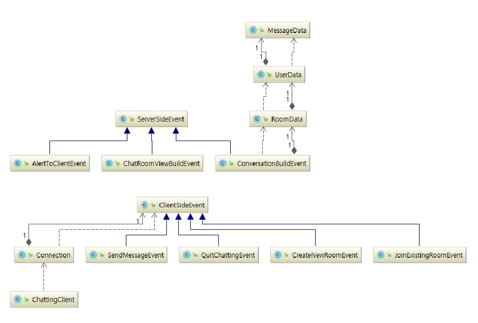

# Chatting server

<a href="#"></a>
<a href="#"></a>
<a href="#"></a>

## 어떤 프로젝트인가요?
- 멀티 채팅 토이 프로젝트.
- 핵심 목표: 다형성, MVC, 쓰레드, 소켓을 짚어보자.
- 제작 기간: 약 10일
- Keyword: MVC, Thread, Socket, Polymorphism, Serializable, Swing, Singleton, Strategy Pattern


## 구현 시 중점 사항
1. `MVC 패턴`을 사용하여 클래스 별 기능이 명확하도록 설계한다.
2. 컨트롤러 클래스는 `싱글톤`이 되도록 하여 불필요한 객체 생성을 막는다.
3. 서버와 클라이언트 간 전달되는 객체는 `전략 패턴`을 사용하여 캡슐화하고, `BlockingQueue`를 활용하여 이벤트가 순서대로 저장되도록 한다.
4. `final 키워드`와 `private 키워드`를 적절히 사용하여 버그의 가능성을 최소화한다.
5. 통신은 모두 `직렬화`된 객체를 사용한다.

## 샘플 화면
##### 대화방 접속 화면


##### 채팅화면


##### 서버 실행 콘솔로그


##### 클라이언트 실행 콘솔로그


<br/>

## 한눈에 보는 전체 구성

##### Server:


##### Client: 




##### Server:
  - 서버는 실행과 동시에 `ServerSocketThread` 를 파생시키고, `ServerSocketThread`는 다시 채팅방별로 `ConnectionThread`를 파생시킨다.
  - 클라이언트 요청은 저장 순서를 지켜주기 위해 `Blocking Queue`에 담아 순차적으로 저장한다.
  - `ConnectionThread` 객체는 클라이언트의 소켓을 분석해 채팅방별로 관리해 적절하게 메시지를 뿌려준다.
<br/>


##### Client: 
  - `Connection`에서 서버와 통신하는 소켓이 열린다. 통신은 모두 `직렬화`된 객체를 사용한다.
  - 소켓은 `ListenThread` 쓰레드 객체로 파생해 진행한다.
  - 보여줄 화면객체를 찾았다면  `View` 객체를 통해 유저에게 화면을 보여준다.

<br/>


## 클래스 단위로 알아보기
#### Server
- `ChattingServer` : main 메소드 안에서 Controller 객체를 싱글톤으로 생성한다.

##### Connection
- `ConnectionHandler` : 채팅을 처리할 쓰레드들을 실행한다.
- `ConnectionThread` : 클라이언트의 소켓을 분석해 채팅방별로 관리해 적절하게 메시지를 뿌려준다. 유저가 방에 접속할때마다 이 쓰레드가 하나씩 생긴다.
- `ServerSocketThread` : 클라이언트의 요청소켓을 받아 각 소켓마다 ConnectionThread를 파생시킨다.
 
##### controller
- `Controller` : 클라이언트의 동작을 해석하는 전략맵을 생성하고 분기한다.
- `StrategyProcessor` : 클라이언트의 동작을 해석하여 실행한다.

##### serverSideEvent
- `ServerSideEvent` : 서버 이벤트의 추상클래스
- `AlertToClientEvent` : 사용자에게 알림을 줄 때 발생하는 이벤트
- `ChatRoomViewBuildEvent` : 채팅창을 구성할 때 발생하는 이벤트
- `ConversationBuildEvent` : 대화를 구성할 때 발생하는 이벤트

##### model.data
- `MessageData` : 메시지 정보를 담고 있다.
- `RoomData` : 방 정보를 담고 있다.
- `UserData` : 사용자 정보를 담고 있다.

#### Cient
- `chattingClient` : Connection 객체를 싱글톤으로 생성한다.

##### Connection
- `Connection` : Socekt 을 열어 원격지 호스트와의 통로를 만든다. 객체를 교환하므로 ObjectIn(Out)putStream 을 열어준다.

##### view
- `ViewController` : 서버의 동작을 해석하는 전략맵을 생성하고 분기한다.
- `ChatRoomView` : 대화창 화면을 그려준다.
- `CreateOrJoinRoomView` : 프로그램 실행시 가장 먼저 보이는 화면을 그려준다.
  
##### clientSideEvent 
- `ClientSideEvent` : 클라이언트 이벤트의 추상클래스
- `CreateNewRoomEvent` : 새로 방을 생성할 때 발생하는 이벤트
- `JoinExistingRoomEvent` : 이미 존재하는 방에 입장할때 발생하는 이벤트
- `QuitChattingEvent` : 사용자가 방을 나갔을 때 발생하는 이벤트
- `SendMessageEvent` : 사용자가 메시지를 입력하고 전송할 때 발생하는 이벤트

### 어떻게 실행하나요?
##### 1. 원하는 디렉토리 위치에서 아래 두 명령어 실행
```
$ git clone https://github.com/YoungEun-IN/CommunicatorServer
```
```
$ git clone https://github.com/YoungEun-IN/CommunicatorServer
```
##### 2. cmd 창에서 프로젝트 위치로 이동
##### 3. 아래 명령어 순차적으로 실행
```
$ java /bin/ChattingServer/ChattingServer

```
```
$ java /bin/ChattingCient/ChattingCient

```
- 참고 : 채팅 프로그램은 5000 포트를 사용합니다.

### 맺으며
- 코딩도 어렵지만 문서화가 더 어려웠다.
- 초반 설계가 정말 어려웠다. 관점 분리가 특히 어려웠다.

##### TODOLIST
  - [ ] MSA 환경으로 업그레이드
  - [ ] 로그인 기능 추가
  - [ ] 파일 log애 저장하는 기능 추가
  - [ ] 채팅방 동적 생성
  - [ ] 모든 상수 필드 외부파일로 빼거나 클래스화
- 취업하고싶다.

### License
This is released under the MIT license.


